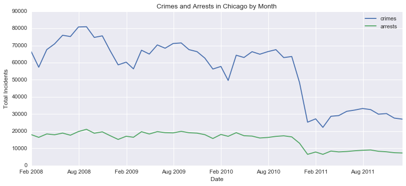
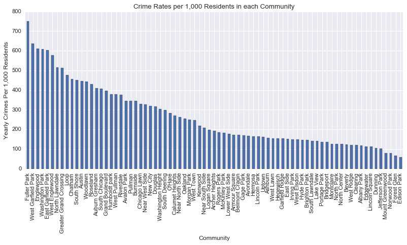

# Chicago Crime EDA
Provide recommendations on resource allocation to assist in lowering crime within the City of Chicago.

### Goals
Evaluate crime data provided for the years of 2008 - 2011 to determine how the City can best allocate financial and man-hour resources to lower the City's crime rate.

### Initial Data Cleaning Approach and Exploratory Findings
A data set cataloging each crime committed within the City of Chicago for the time period stated above was downloaded from the kaggle website (https://www.kaggle.com/currie32/crimes-in-chicago).  The data includes various time, location and type variables for each recorded event.

events containing null values in the community_area_name field were removed to allow for summarizing the data by neighborhood in future steps.  This affected less than 1,500 of the approximately 2.5 million events.

To aid in our analysis, additional data for socioeconomic factors for each community over the same time period was downloded from the Chicago Data Portal. (https://data.cityofchicago.org/Health-Human-Services/Census-Data-Selected-socioeconomic-indicators-in-C/kn9c-c2s2).  Population data from the 2010 census was also acquired. (https://www.cityofchicago.org/city/en/depts/dcd/supp_info/community_area_2000and2010censuspopulationcomparisons.html)

Data from the crimes data set was resampled by month and plotted along with the corresponding arrests.

The crime data was then separated by community.  The average number of crimes per year in each community was then determined.  To allow for comparison between communities, community population was used to determine crime per 1,000 residents.

### Initial Research Findings

1. **Crime Patters** - Crime within the City as a whole has clear annual pattern, with more crime occurring during the summer months and less during winter months.  There was also a sharp decline in crime in the Winter of 2010-2011.

2. **Arrests** - Arrests made appears to be more linear and consistent.  Arrests rates do not appear to be affected by season.  There was a corresponding decline in arrests in the Winter of 2010-2011.

3. **Crime by Community** - There is a clear distinction between communities with the higher and lower crime rates.

### Further Research and Analysis

1. Are there additional crime patterns that can be found in the data?  Do patterns vary by community?

2. Are there socioeconomic factors that may be associated with crime rates within the City's communities?

3. Are there additional patterns or socioeconomic factors that may be associated with violent crime?
