# Chicago Crime EDA
Provide recommendations on resource allocation to assist in lowering crime within the City of Chicago.

### Introduction
This is an open-ended Exploratory Data Analysis project for the Data Science program at [K2 Data Science](http://k2datascience.com).  A minimum valuable product (MVP) of this project can be found on the [MVP page](MVP.md).

### Goals
Evaluate crime data provided for the years of 2008 - 2011 to determine how the City can best allocate financial and man-hour resources to lower the City's crime rate.

### Assumptions
The first documented use of crime statistics as a basis for deployment of resources occurred when Jack Maple, then a Transit police officer in New York City, began tracking crime using paper maps in the early 90s.  His system would soon be formalized and adopted by the entire New York City Police Department under the moniker COMPSTAT (short for Computer Statistics).

Since being adopted by the NYPD more than two decades ago, various other local law enforcement agencies have followed suit.  Though strategies differ, the overall goal is to track crime over time to allow for targeted interventions.  For our analysis crimes were divided by community to allow for concurrent evaluation of community level socioeconomic data.  Geographical coordinates were provided with the data as well, which would allow for a more refined approach if time allowed.

### Approach
The crime data was acquired from [kaggle](https://www.kaggle.com/currie32/crimes-in-chicago).  The data was originally extracted from the Chicago Police Department's CLEAR (Citezen Law Enforcement Analysis and Reporting) system.  Data was available for the years of 2001-2017.  For simplicity, our analysis only covers the years 2008 - 2011.

To aid in our analysis, socioeconomic data for the years 2008-2012 was acquired from the [Chicago Data Portal](https://data.cityofchicago.org/Health-Human-Services/Census-Data-Selected-socioeconomic-indicators-in-C/kn9c-c2s2).  Finally, population data was obtained from the [City of Chicago](https://www.cityofchicago.org/city/en/depts/dcd/supp_info/community_area_2000and2010censuspopulationcomparisons.html).

### Cleaning and Exploring the Data

The crimes data set included various time, location and type attributes for each recorded event.  events containing null values in the community_area_name field were removed to allow for summarizing the data by neighborhood in future steps.  This affected less than 1,500 of the approximately 2.5 million events.

The socioeconomic and population data contains only a summary row for each community.  The majority of the cleaning required for all data included in our analysis was contained to data type manipulation.

As stated on the [MVP page](MVP.md), crime and arrest data for the entire city was first plotted by month.  The crime data was then separated by community and population data was utilized to plot crime rates for each community.

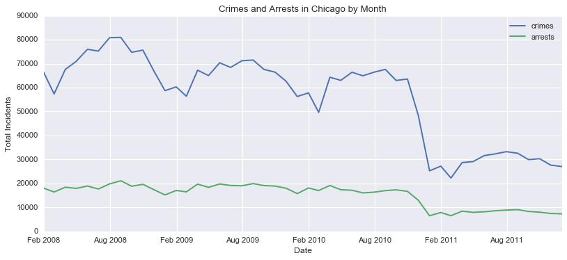

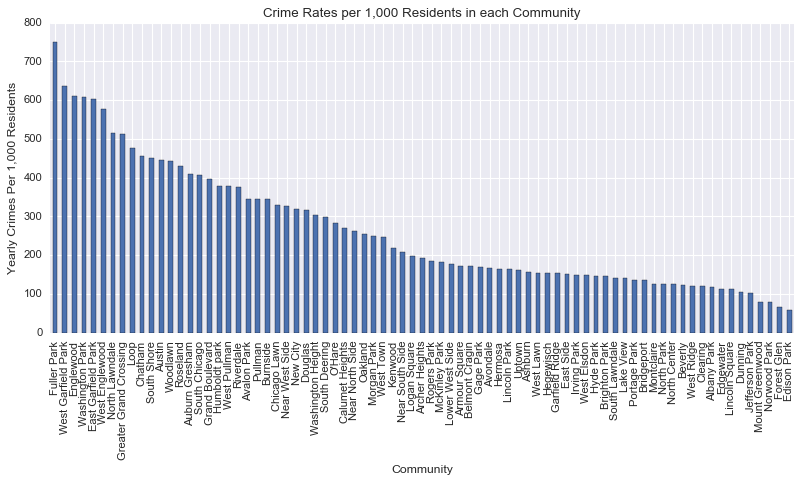

The population data was then sorted and plotted to compare between communities.  This plot provides little information outside of a reference point for community size.

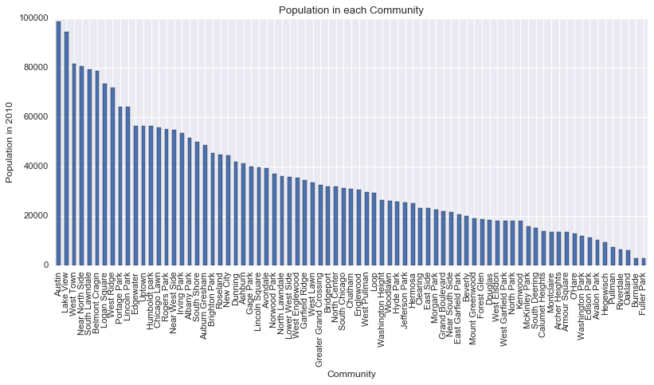

To better understand yearly crime patterns and how they may differ between communities, our next plot separated the 10 communities with the highest overall crime rates and the 10 communities with the lowest overall crime rates and plotted the number of crimes per month over the 4 years of data.

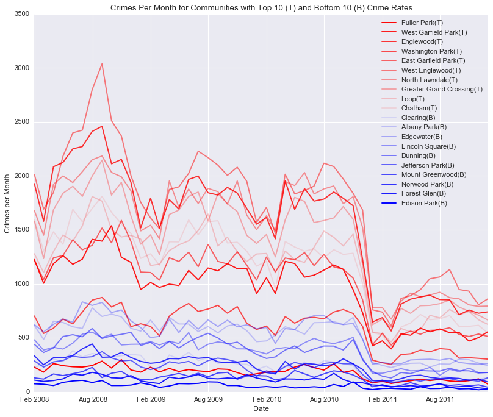

As one would expect, the communities with the highest crime rates typically had higher monthly crime totals.  Additionally, the yearly crime pattern of spikes during the warmer months and lulls during the colder months which was apparent on the overall graph for the entire city, is much more apparent in communities with higher crime rates.

To allow for better comparison, a similar graph was created to compare the crime rates per 1,000 residents amongst the same communities.

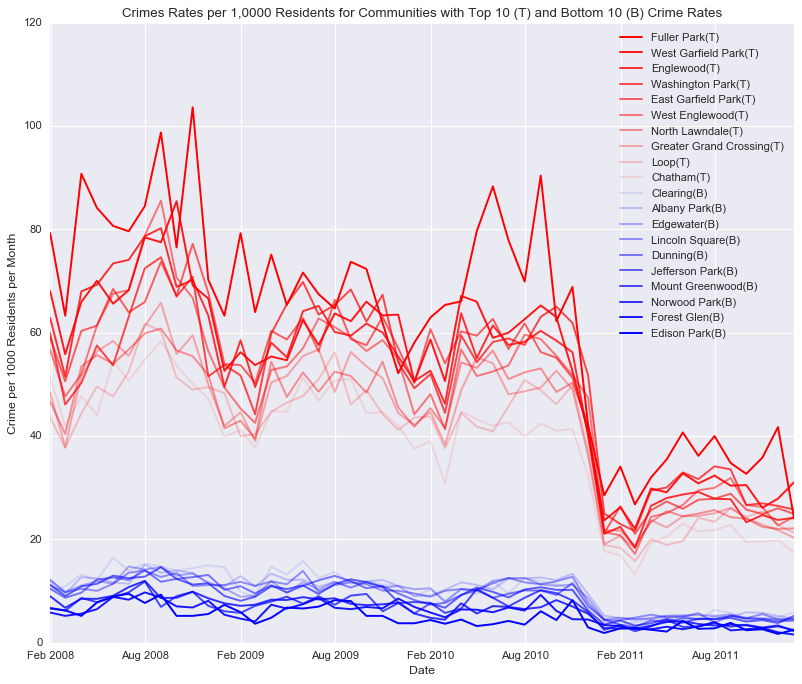

It was noted that the overall drop in crime that occurred in the City as a whole in the 2010-2011 winter months can be seen across each of the observed communities.  This indicates that improvements in crime rates were likely not limited to particular locations within the City.

We became curious if communities with high and low overall crime rates had correspondingly high or low violent crime rates.  The data did not include attributes that specifically identified a crime as violent or non-violent.  Though the definition of violent crime could vary depending on circumstances, for the purposes of our analysis we counted crimes classified as Homicide, Battery, Criminal Sexual Assault, Assault and Robbery as violent crimes.  All other crimes were considered non-violent.

After sorting the data by violent vs. non-violent we created a graph to show violent crime rates per 1,000 residents for the same communities as above.

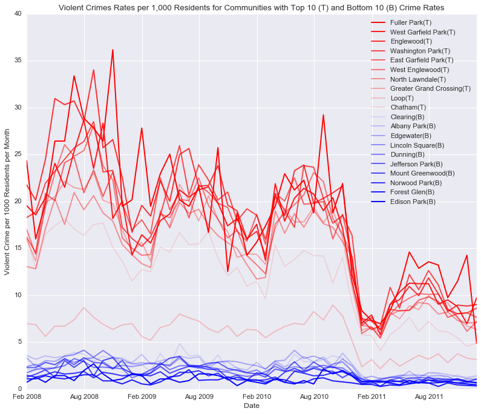

It appears that violent crime rates follow closely with overall crime rates, at least based on the communities observed.

It was observed in the first graph showing crime and arrest rates at the City level that the number of arrests remained relatively constant through the seasonal variation in crime rates.  We became curious if arrest rates were higher or lower in communities with higher crime rates when compared to communities with lower crime rates.  Also, were there any observable trends?

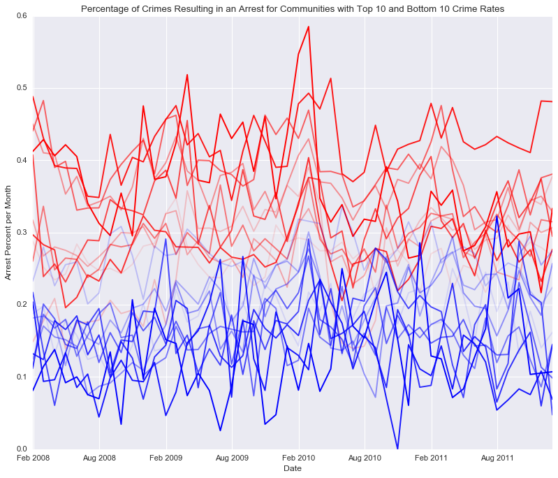

It appears that more crimes result in an arrest in communities with higher crime rates.  However, there does not seem to be any discernible overall pattern.

Moving back to observing crime rates over time, we next grouped crime and violent crime by community and hour of day.

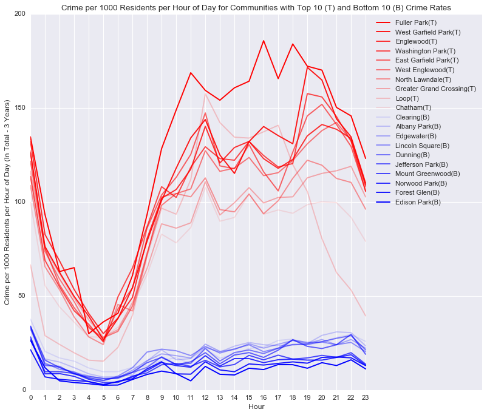

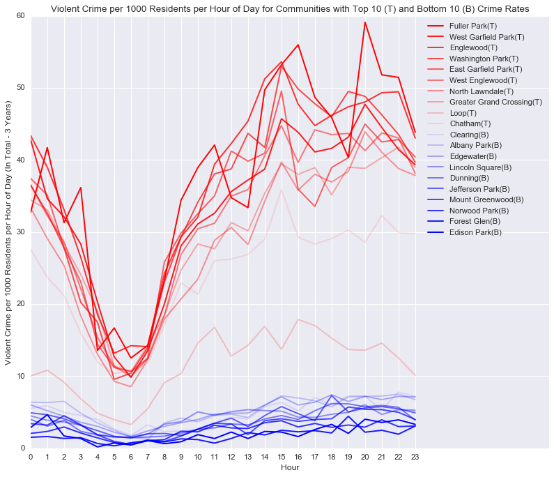

It can be observed that both overall crime rates and violent crime rates vary over the course of a typical day, with a clear low point in the early morning hours.  However, the variation is much more pronounced in communities with higher crime rates.

### Examining Socioeconomic Factors Across Communities

Next we took a brief look at socioeconomic factors in an effort to understand if there is any correlation with crime rates.  First we used our data that was sorted by crime rate and created a corresponding bar chart for each of a few socioeconomic factors.

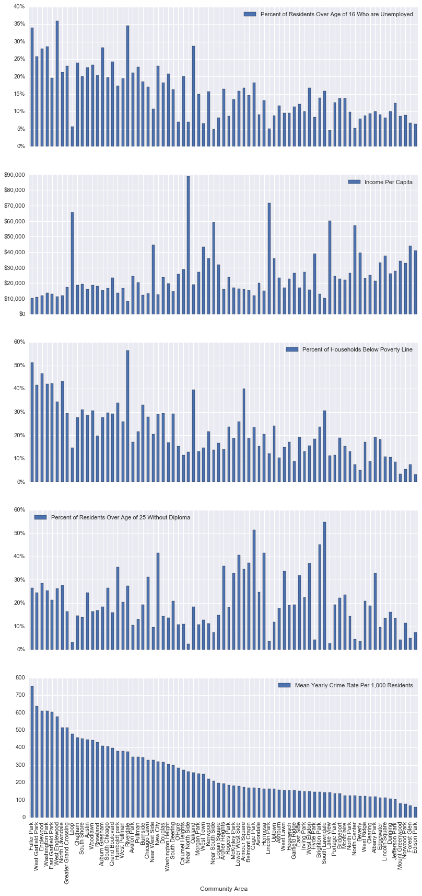

At first glance it looks like there may be a correlation between crime rates and percent of households below the poverty line as well as crime rates and percent of residents over 16 who are unemployed.  We decided to compute a simple correlation table using a pearson correlation coefficient.

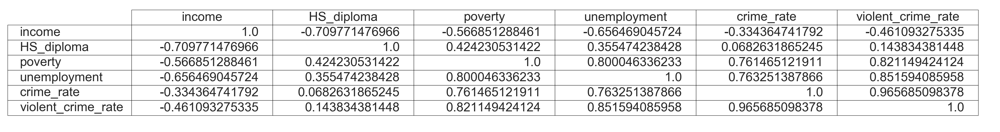

The pearson correlation coefficient indicates a high correlation between poverty rate and crime rate as well as unemployment rate and crime rate.  It was also noted that high school graduation rate and income per capita did not have a strong correlation with crime rates.  There is also a high correlation between crime rates and violent crime rates.  Something we had begun to infer above.  

To better visualize the data we decided to use a scatter plot on the socioeconomic factors that showed a high correlation with crime and violent crime rates.

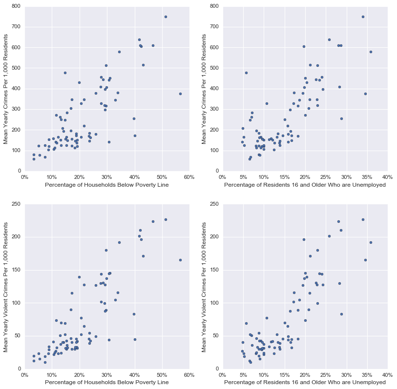

### Final Recommendations and Further Analysis

Based on our analysis we believe that there are several areas the City could examine further to refine financial and man-hour resource allocation.  First, it is clear which communities have higher crime rates.  Deployment of additional police officers to those communities may assist in lowering crime and violent crime rates.  Crime tends to follow a daily and seasonal pattern, especially in communities with high crime rates.  Continuing to track this data while deploying more officers to high crime areas during times when crime tends to peak may show positive results.

In regards to socioeconomic factors, it is clear that there is a correlation between unemployment, poverty and crime rates.  While this does not show causation, it may be worth exploring various interventions to address poverty and unemployment in communities with high crime rates.

Below are items we would have explored if we had more time:

1. Examine additional data surrounding the large drop in crime that occurred in the winter of 2010-2011.  Was there a shift in police policy around this time?  Did outside factors influence the drop?  This was near the period in time where the economy began to improve, were there socioeconomic changes within the City?

2. Examine how socioeconomic factors changed throughout the communities over a longer period of time.  How did the crime rates change over the same period of time?

3. Use geospatial methods to explore the data.  Instead of using community lines which may be somewhat arbitrary, could we instead use the geographical coordinates to cluster the data?

4. Examine if crime in communities with lower crime rates is less affected by the seasons.  Could this be because the type of crime committed in those communities?  The data includes location descriptions (street, alley, etc.) that could be used for this analysis as well.
